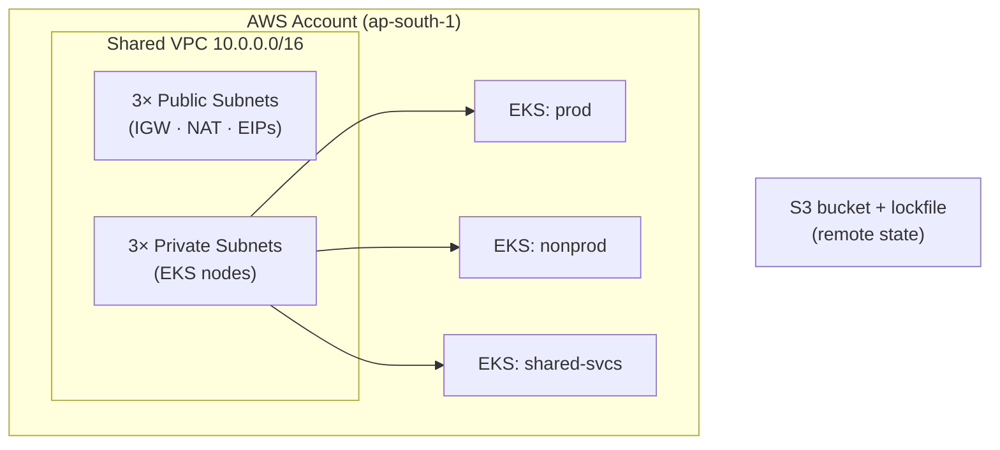

# Production-Grade AWS EKS Platform (Terraform)

A multi-environment Amazon EKS platform built from scratch with Terraform, using
a reusable-module architecture, remote state, and security hardening. Built as a
portfolio project to demonstrate infrastructure design — not just wiring up
public modules, but designing the structure and writing the modules myself.

## Architecture overview

The platform provisions a single shared VPC spanning three Availability Zones and
runs three EKS clusters inside it — **prod**, **nonprod**, and **shared-services** —
each created from the same reusable `modules/eks` module. State lives remotely in
S3 with S3-native lockfile-based locking (no DynamoDB lock table required).



### Repository layout

```
bootstrap/        # one-time: creates the S3 state bucket (local state, run once)
network/          # root: calls modules/vpc — owns the shared VPC state
prod/             # root: calls modules/eks, reads VPC state via terraform_remote_state
nonprod/          # root: same module, nonprod inputs
shared-svcs/      # root: same module, shared-services inputs
modules/
  vpc/            # VPC, subnets, IGW, NAT GW, route tables
  eks/            # EKS control plane, managed node group, IRSA, EBS CSI add-on
.github/workflows/
  terraform-ci.yml   # CI: fmt · validate · tflint · checkov (no AWS creds needed)
  terraform.yml      # (legacy fmt+validate workflow — superseded by terraform-ci.yml)
.pre-commit-config.yaml   # local developer hooks (same checks as CI)
.tflint.hcl               # tflint plugin config (AWS ruleset)
.terraform-docs.yml       # terraform-docs output format config
```

### Design decisions

**Single shared VPC.** Three VPCs would give stronger blast-radius isolation — the
production answer. This project uses one VPC to keep cost low (one NAT gateway
shared across all clusters) and to focus on the EKS and module design rather than
VPC peering.

**Modules vs. roots.** `modules/vpc` and `modules/eks` are reusable code with no state
of their own. Each environment directory is a *root* with its own remote state file.
One module, three callers — adding a fourth environment is a new root directory and a
`terraform apply`.

**Cross-root state composition.** Cluster roots read subnet IDs from the network
root's remote state via `terraform_remote_state` rather than duplicating VPC
config in every environment.

**Bootstrap chicken-and-egg.** Remote state needs an S3 bucket, but that bucket is
created by Terraform. `bootstrap/` breaks the loop: it uses local state to provision
the bucket, then every other root configures that bucket as its backend.

**S3-native state locking.** Uses `use_lockfile = true` (S3 conditional writes) rather
than a DynamoDB lock table — one fewer moving part, and the current Terraform best
practice.

## Security hardening

- **IMDSv2 enforced** on worker nodes (`http_tokens = "required"`, hop limit = 1),
  closing the IMDSv1 SSRF credential-theft path and blocking pods from reading
  node-level credentials.
- **Encrypted EBS root volumes** (`encrypted = true`, gp3) on all worker nodes.
- **IRSA** (IAM Roles for Service Accounts): the EBS CSI driver uses a dedicated IAM
  role scoped to its Kubernetes service account via the cluster OIDC provider — no
  static credentials, least privilege per workload.

## Apply order

State and networking must exist before clusters. Apply in this order:

```
1. bootstrap/              # S3 bucket + S3 lockfile support (run once, then leave alone)
2. network/                # shared VPC, subnets, NAT gateway
3. prod/ nonprod/ shared-svcs/   # clusters — independent, can run in parallel
```

```bash
# 1. Bootstrap (first time only)
cd bootstrap && terraform init && terraform apply

# 2. Network
cd ../network && terraform init && terraform apply

# 3. A cluster (repeat for each environment)
cd ../prod && terraform init && terraform apply
```

> **Cost warning.** The EKS control plane (~$0.10/hr per cluster) and NAT gateway
> (~$32/mo) are **not** free tier. `terraform plan` is free; only `apply`
> deliberately, and `terraform destroy` when done.

## CI

CI runs on every pull request and push to `main` via
`.github/workflows/terraform-ci.yml`. No AWS credentials are needed — all checks
are static analysis only and nothing is ever deployed from CI.

The workflow runs four jobs, each as a matrix over all environment and module
directories (`network`, `nonprod`, `prod`, `shared-svcs`, `modules/vpc`,
`modules/eks`):

| Job | Tool | What it checks |
|-----|------|----------------|
| `fmt` | `terraform fmt -check -recursive` | Canonical HCL formatting |
| `validate` | `terraform validate` (after `init -backend=false`) | Provider schema correctness, expression types |
| `tflint` | tflint + AWS ruleset plugin | AWS-specific best practices and deprecated resource arguments |
| `checkov` | checkov | Security and misconfiguration findings against the `.tf` files |

`fmt` runs once across the whole repo. The other three run per-directory in parallel
via GitHub Actions matrix so a failure in one directory does not hide failures in
another. The entire workflow fails if any step exits non-zero.

### Adding a new environment

1. Create a new directory (e.g. `staging/`) with `main.tf`, `variables.tf`,
   `outputs.tf`, `providers.tf`, and `terraform.tfvars`.
2. Add `staging` to the `matrix.dir` list in `.github/workflows/terraform-ci.yml`
   and to the hooks in `.pre-commit-config.yaml`.

## Pre-commit hooks

The same four checks that run in CI are wired up as local pre-commit hooks so
problems are caught before a push.

### Install

```bash
# 1. Install pre-commit (requires Python)
pip install pre-commit

# 2. Install tflint (macOS with Homebrew; see tflint docs for other platforms)
brew install tflint

# 3. Install checkov
pip install checkov

# 4. Wire up the hooks into .git/hooks/
pre-commit install
```

### Run manually

```bash
# Against all files (useful after cloning or changing hook config)
pre-commit run --all-files

# Against staged files only (what git commit triggers)
pre-commit run
```

The hook config lives in `.pre-commit-config.yaml`. The tflint plugin declaration
(`aws` ruleset) is in `.tflint.hcl`.

## Generating module documentation

Module READMEs (`modules/vpc/README.md`, `modules/eks/README.md`) were generated
with [terraform-docs](https://terraform-docs.io) using the config in
`.terraform-docs.yml`. To regenerate after editing a module:

```bash
# Install terraform-docs (macOS)
brew install terraform-docs

# Regenerate (updates the <!-- BEGIN_TF_DOCS --> block in place)
terraform-docs modules/vpc
terraform-docs modules/eks
```

## Possible improvements

- Add `required_providers` blocks inside each module to pin provider versions
  independently of the roots.
- Use three NAT gateways (one per AZ) for true high availability.
- Add Terraform `plan` output on pull requests via GitHub OIDC federation (no
  long-lived keys), making plan diffs visible in PR reviews.
- Per-environment right-sizing (smaller node groups for nonprod).
- Native `terraform test` coverage for the EKS module (the VPC module already has
  `modules/vpc/tests/vpc.tftest.hcl` with mocked-provider plan assertions).
