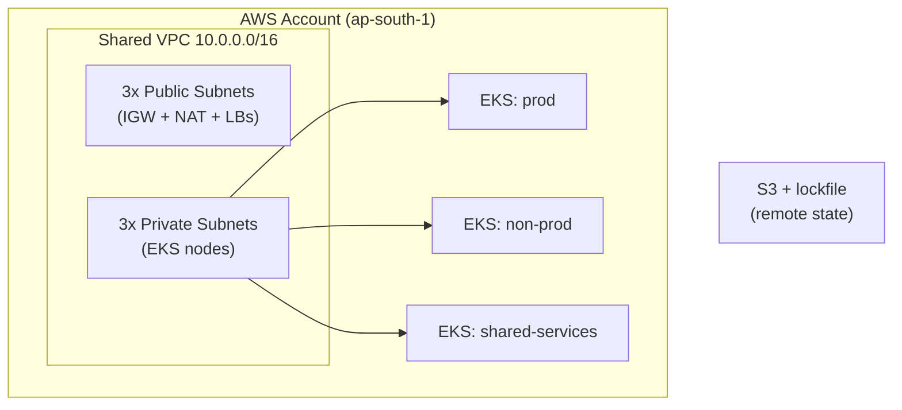

# Production-Grade AWS EKS Platform (Terraform)

A multi-environment Amazon EKS platform built from scratch with Terraform, using
a reusable-module architecture, remote state, and security hardening. Built as a
portfolio project to demonstrate infrastructure design — not just wiring up
public modules, but designing the structure and writing the modules myself.

## Overview

The platform provisions a single shared VPC spanning three Availability Zones and
runs three EKS clusters inside it — **prod**, **non-prod**, and **shared-services** —
each created from one reusable EKS module. State lives remotely in S3 with native
lockfile-based locking.



## Repository layout

```
bootstrap/        # ROOT (local state): creates the S3 state bucket + DynamoDB table
network/          # ROOT: calls modules/vpc, owns the shared VPC state
prod/             # ROOT: calls modules/eks, reads network via terraform_remote_state
nonprod/          # ROOT: same module, non-prod inputs
shared-svcs/      # ROOT: same module, shared-services inputs
modules/
  vpc/            # reusable VPC (subnets, IGW, NAT, route tables) + tests
  eks/            # reusable EKS (control plane, node group, IRSA, EBS CSI)
.github/workflows/
  terraform.yml   # CI: fmt + validate on every push/PR
```

## Design decisions

**Single shared VPC (vs. one per environment).** Three VPCs win on blast radius and
security boundaries — the true production answer. This project uses one shared VPC to
cut cost (all clusters share one NAT gateway) and complexity (no peering / Transit
Gateway), keeping the focus on EKS and module design.

**Modules vs. roots.** `modules/vpc` and `modules/eks` are reusable code with no state
of their own. Each environment directory is a *root* — it has its own state and *calls*
the module with different inputs. One module, three callers.

**Cross-root state composition.** Cluster roots read the VPC's subnet IDs from
network's remote state via the `terraform_remote_state` data source, rather than
duplicating VPC config per environment.

**Bootstrap chicken-and-egg.** Remote state needs an S3 bucket, but the bucket is
created by Terraform. `bootstrap/` breaks the loop: it runs on local state and creates
the bucket + lock table; every other root then uses that as its backend.

**State locking.** Uses S3-native `use_lockfile` (conditional writes) instead of a
DynamoDB lock table — the current best practice, one fewer moving part.

## Security hardening

- **IMDSv2 enforced** (`http_tokens = "required"`) on worker nodes, closing the
  IMDSv1 SSRF credential-theft path. Metadata hop limit set to 1 to block pods from
  reaching node credentials.
- **EBS encryption** on node root volumes (`encrypted = true`).
- **IRSA** (IAM Roles for Service Accounts): the EBS CSI driver assumes a scoped IAM
  role via the cluster's OIDC provider — no static keys, least privilege per service
  account.

## Build order

State and networking must exist before clusters. Apply in this order:

```
1. bootstrap/     # S3 bucket + lock table
2. network/       # shared VPC, subnets, NAT
3. prod/ nonprod/ shared-svcs/   # clusters (independent — any order / parallel)
```

## Usage

```bash
# 1. Backend
cd bootstrap && terraform init && terraform apply

# 2. Network
cd ../network && terraform init && terraform apply

# 3. A cluster
cd ../prod && terraform init && terraform apply
```

> **Cost warning.** The EKS control plane (~$0.10/hr per cluster) and NAT gateways
> (~$32/mo) are **not** free tier. For evaluation, `terraform plan` is free and
> sufficient. Only `apply` deliberately, and `terraform destroy` when done.

## CI & testing

- **CI** (`.github/workflows/terraform.yml`): runs `terraform fmt -check` and
  `terraform validate` on every push and PR. Uses `init -backend=false`, so no AWS
  credentials are needed.
- **Tests** (`modules/vpc/tests/vpc.tftest.hcl`): native `terraform test` with a
  mocked AWS provider and plan-only assertions (no cost) verifying subnet counts and
  the VPC CIDR.

## Possible improvements

- Add a `required_providers` block inside each module to pin provider versions
  independently of the roots.
- Use three NAT gateways (one per AZ) for production high availability.
- Add `plan`-on-PR to CI via GitHub OIDC federation to AWS (no long-lived keys).
- Per-environment right-sizing (smaller node groups for non-prod).
